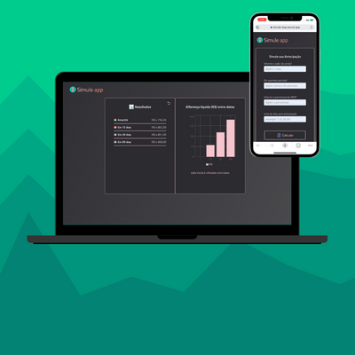

 
# :moneybag: Frontend Challenge

Desafio Frontend, um web app para cálculo de antecipação de uma transação. Possibilita com que o usuário manipule dados de entrada para tomada de decisão baseado nos resultados providos.

> Aplicação rodando no [Vercel](https://simule-bay.vercel.app/)

💭 Features principais:\
\
:heavy_check_mark: Gráfico com diferenças liquidas em relação a data inicial\
:heavy_check_mark: Lista de dias customizada para consulta

## 📋 Instruções

Como instalar esse projeto:

- Faça um clone deste repositório;
- Na pasta raiz do projeto, rode o comando `yarn` no terminal para instalar os pacotes de dependencias;
- Na pasta raiz do projeto, rode o comando `yarn start` no terminal para rodar o projeto;
- No seu navegador, abra o link indicado no terminal.

## 💻 Tecnologias

Algumas das principais tecnologias utilizadas:

      
  

## :checkered_flag: Testes

Rodando testes de componentes:

- `yarn run cypress run --component`

Rodando testes e2e:

- `yarn start` para que a aplicação esteja rodando no localhost;
- Abrir outro terminal;
- `yarn run cypress run`

Explorando testes:
  
 > Componentes:

  - Para os testes dos componentes, foram testados os que são reutilizados como Inputs, Button e Header.
  
 > e2e:

  - Funcionalidade basica de preencher os inputs e submit para obter resultados;
  - Mock do retorno da api para teste da rederização do card de resultados;
  - Teste de retorno da seção de resultados para o card inicial com o form;
  - Teste para verificação se inputs inválidos são acusado pela validação do form.

## 🔗 Uteis

> [API](https://frontend-challenge-7bu3nxh76a-uc.a.run.app)
